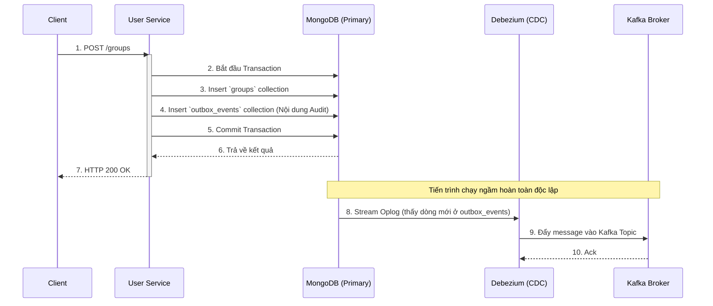
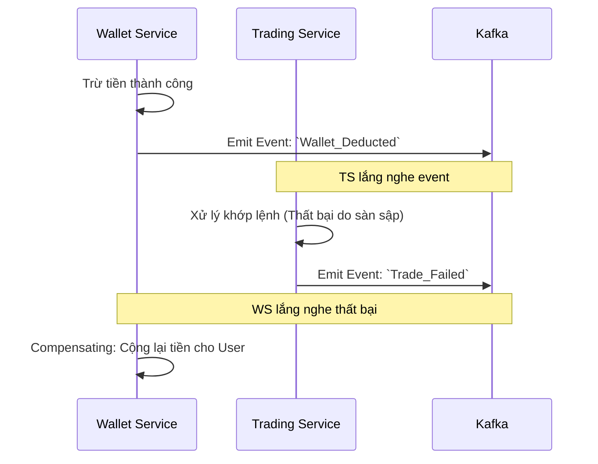
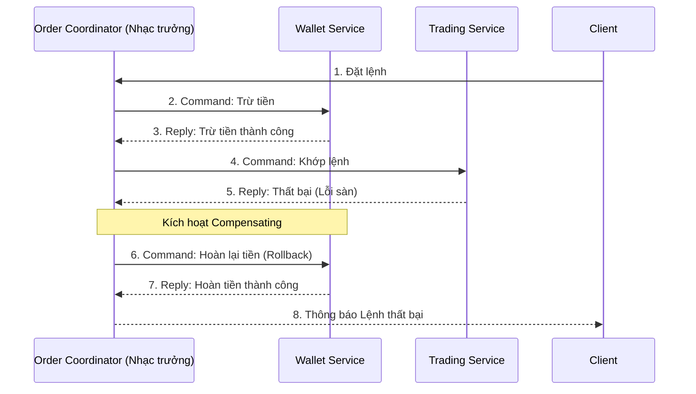

# Kiến trúc Nhất quán Dữ liệu Phân tán (Distributed Data Consistency)

Tài liệu này phân tích sâu về các bài toán nâng cao trong kiến trúc Microservices liên quan đến tính nhất quán của dữ liệu, cụ thể là vấn đề **Dual-Write** và giải pháp **Transactional Outbox Pattern**, cũng như quản lý giao dịch qua nhiều dịch vụ bằng **Saga Pattern**. Đây là những kiến thức cốt lõi phân biệt một thiết kế ở mức độ Senior so với cấp độ Staff/Architect.

---

## 1. Bài toán Dual-Write (Lỗi Ghi Kép)

### 1.1 Khái niệm
**Dual-Write** là tình huống một hệ thống (hoặc ứng dụng) cần cập nhật dữ liệu đồng thời vào hai hệ thống lưu trữ/truyền thông tin khác nhau trong cùng một luồng nghiệp vụ.
Phổ biến nhất trong Microservices là: **Lưu vào Database** VÀ **Gửi Message lên Message Broker (Kafka/RabbitMQ)**.

### 1.2 Phân tích rủi ro trong đoạn code hiện tại
Nhìn vào `GroupServiceImpl.java` hiện tại:

```java
@Override
@Transactional
public GroupDto createGroup(GroupDto dto, String performedBy) {
    Group group = groupMapper.toEntity(dto);
    
    // Bước 1: Lưu vào Database (MongoDB)
    Group saved = groupRepository.save(group); 
    
    // Bước 2: Bắn Message lên Kafka
    auditProducerService.sendAuditLog(AuditLogEvent.builder()...build());
            
    return groupMapper.toDto(saved);
}
```

Đây là mô hình **Dual-Write** kinh điển. Vấn đề nghiêm trọng ở cấp độ hệ thống lớn (High Availability) là tính không nguyên tử (Non-atomic) giữa Database và Kafka:
- **Trường hợp 1**: DB lưu thành công, nhưng Kafka đang down / Network timeout $\rightarrow$ Lỗi xảy ra. Transaction Database (nếu là Relational DB) có thể rollback, nhưng đôi khi Exception bắt không đúng cách hoặc app crash ngay dòng đó $\rightarrow$ DB đã lưu, nhưng không có Audit Log.
- **Trường hợp 2**: DB lưu thành công, App bắn lên Kafka thành công, Kafka nhận được. Nhưng ngay sau đó Database Transaction bị lỗi (ví dụ lỗi trigger, lỗi unique constraint muộn) và bị Rollback $\rightarrow$ Database không có dữ liệu, nhưng Kafka lại báo là đã tạo thành công. Các Service khác nghe Kafka sẽ cập nhật sai lệch dữ liệu.

$\Rightarrow$ **Hậu quả**: Dữ liệu giữa các hệ thống (Microservices) bị mất đồng bộ vĩnh viễn (Data Inconsistency).

---

## 2. Tiêu chuẩn Architect: Transactional Outbox Pattern & CDC

Để giải quyết triệt để Dual-Write, Staff/Architect áp dụng **Transactional Outbox Pattern** kết hợp với **CDC (Change Data Capture)**.

### 2.1 Tư duy của Outbox Pattern
Thay vì cố gắng "Lưu DB" và "Gọi Kafka" cùng lúc (không thể đảm bảo Transaction chung vì hai hệ thống khác công nghệ), ta sẽ **Lưu Data** và **Lưu Event** vào chung một Database, chung một Transaction.

- Database đóng vai trò là "Single Source of Truth".
- Tạo thêm một bảng/collection tên là `outbox_events`.
- Việc Database hỗ trợ ACID Transaction đảm bảo việc lưu Entity và lưu Event là **All-or-Nothing** (thành công cả hai hoặc thất bại cả hai).

### 2.2 Sự kết hợp với Debezium (CDC)
Làm sao để lấy Event từ bảng `outbox_events` đẩy lên Kafka? Chúng ta không dùng App để quét (cronjob polling) vì sẽ làm chậm DB. Ta dùng **Debezium**.

- Debezium là một công cụ CDC (Change Data Capture). Nó sẽ đọc trực tiếp vào **Oplog (MongoDB)** hoặc **Binlog (MySQL)** ở tầng database engine.
- Bất cứ khi nào có dòng mới chèn vào `outbox_events`, Debezium nhận diện được ngay lập tức ở mức mili-giây và âm thầm đẩy nội dung đó lên Kafka.
- Nếu Debezium/Kafka bị crash, khi khởi động lại, Debezium sẽ đọc tiếp từ vị trí log cũ (offset), đảm bảo **At-least-once delivery** (Không bao giờ mất message).

### 2.3 Sơ đồ Hoạt động



---

## 3. Bài toán Giao dịch Phân tán (Distributed Transaction) & Saga Pattern

Outbox Pattern giải quyết việc *1 service nói chuyện với Broker*. Nhưng nếu 1 luồng nghiệp vụ đòi hỏi thay đổi dữ liệu ở **nhiều Service khác nhau** thì sao?

### 3.1 Vấn đề của Microservices
Giả sử Trading Journal có tính năng **"Tạo Lệnh Giao Dịch Có Phí"**:
1. `Wallet Service`: Trừ tiền trong ví (Wallet).
2. `Trading Service`: Khớp lệnh trên sàn (Trade).

Trong Monolith, bạn chỉ cần 1 cái `@Transactional` bọc ngoài là xong. Nếu bước 2 lỗi, DB tự Rollback bước 1.
Nhưng trong Microservices, `Wallet Service` và `Trading Service` là 2 app độc lập, 2 Database độc lập. Không có cái gọi là "Global Transaction" hoạt động hiệu quả. Nếu Trừ tiền xong, nhưng Khớp lệnh thất bại (chứng khoán bảo trì), tiền của user đã bị trừ $\rightarrow$ **Thảm họa**.

### 3.2 Giải pháp: Saga Pattern
Saga chia một luồng lớn thành nhiều **Giao dịch cục bộ (Local Transactions)** liên tiếp nhau. Đặc điểm cốt lõi của Saga là **Giao dịch Bù trừ (Compensating Transaction)**. Nếu một bước thất bại, hệ thống phải tự động gọi các hàm "rollback ngược" để hoàn tác các bước trước đó (VD: Thất bại khớp lệnh thì gọi hàm Cộng lại tiền).

Có 2 mô hình thiết kế Saga:

#### A. Saga Choreography (Vũ đạo)
- **Đặc điểm**: Không có ai chỉ huy. Các service làm xong việc của mình thì la lên (bắn Event), service khác tự nghe và làm tiếp.
- **Ưu điểm**: Lỏng lẻo (Decoupled), không có điểm chết tập trung (No single point of failure).
- **Nhược điểm**: Rất khó theo dõi flow (Tracking), dễ tạo thành vòng lặp vô tận, debug cực hình nếu có lỗi.
- **Sơ đồ Choreography**:



#### B. Saga Orchestration (Nhạc trưởng)
- **Đặc điểm**: Có một **Coordinator (Nhạc trưởng)** đứng ra điều phối. Coordinator sẽ ra lệnh "Service A trừ tiền đi", A làm xong báo lại, Coordinator ra lệnh tiếp "Service B khớp lệnh đi".
- **Ưu điểm**: Dễ dàng theo dõi tiến trình (nhìn vào Coordinator là biết đang kẹt ở đâu), dễ maintain nghiệp vụ phức tạp.
- **Nhược điểm**: Có nguy cơ Coordinator trở thành điểm nghẽn cổ chai (Bottleneck) hoặc Single Point of Failure.
- **Sơ đồ Orchestration**:



### 3.3 Lời khuyên áp dụng thực tế
- Khi xây dựng hệ thống tài chính (Trading/Banking), **Saga Orchestration** luôn được ưu tiên vì sự kiểm soát trạng thái tuyệt đối. Các công cụ thường dùng để làm Nhạc trưởng là **Temporal, Camunda, hoặc AWS Step Functions**.
- Việc kết hợp **Outbox Pattern** vào trong **Saga Pattern** (để đảm bảo Event của Saga không bao giờ bị mất) chính là kiến trúc phân tán ở đẳng cấp cao nhất của ngành Software Engineering hiện nay.
